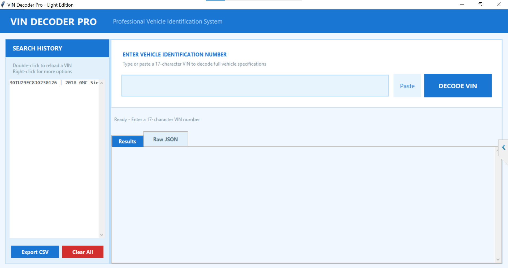
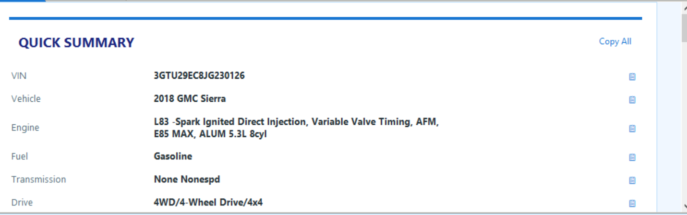
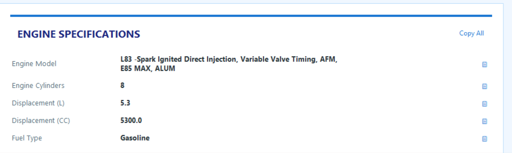
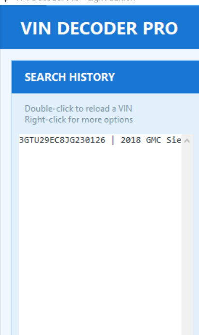

# VIN Decoder Pro

<p align="center">
  
</p>

<h3 align="center">Professional Vehicle Identification Number Decoder</h3>

<p align="center">
  <a href="#features">Features</a> •
  <a href="#installation">Installation</a> •
  <a href="#usage">Usage</a> •
  <a href="#screenshots">Screenshots</a> •
  <a href="#api">API</a> •
  <a href="#license">License</a>
</p>

<p align="center">
  
  
  
  
</p>

---

## Overview

**VIN Decoder Pro** is a professional desktop application for decoding Vehicle Identification Numbers (VIN). Built for automotive professionals, ECU tuners, mechanics, and car dealers who need instant access to detailed vehicle specifications.

Enter any 17-character VIN and get comprehensive vehicle data including engine specifications, transmission details, safety features, dimensions, and manufacturer information — all powered by the official **NHTSA VPIC database**.

---

## Features

### Core Functionality
- **Instant VIN Decoding** — Decode any 17-character VIN in seconds
- **Engine Specifications** — Model, displacement (L & CC), cylinders, power (kW & HP), fuel type, configuration, compression ratio
- **Transmission & Drivetrain** — Style, speeds, drive type, axle configuration, wheel base
- **Safety & Technology** — ABS, ESC, TPMS, airbag locations, blind spot monitor, lane keep, adaptive cruise control
- **Dimensions & Capacity** — GVWR, GCWR, bed/cab type, doors, seats
- **Manufacturer Details** — Full manufacturer info, plant location, NCSA classifications

### User Experience
- **Light Blue Professional Theme** — Clean, modern interface with blue accent colors
- **One-Click Copy** — 📋 Copy button on every value for instant clipboard access
- **Copy All** — Copy entire sections with one click
- **Paste Button** — Quick paste and auto-clean VIN from clipboard
- **Right-Click Context Menu** — Cut / Copy / Paste / Select All on input fields
- **Search History** — Auto-saves last 100 decoded VINs with full details
- **Export to CSV** — Export entire search history to CSV file
- **Raw JSON View** — View complete raw API response with copy/save options
- **Quick Summary Card** — Most important specs at a glance

### Data Management
- **Persistent History** — History saved to `vin_history.json` (auto-loads on startup)
- **Duplicate Prevention** — Re-decoding same VIN updates existing entry
- **History Sidebar** — Double-click to reload, right-click for options
- **CSV Export** — Full history export with all vehicle details

---

## Installation

### Prerequisites
- Python 3.7 or higher
- Internet connection (for NHTSA API access)

### Step 1: Clone Repository
```bash
git clone https://github.com/3bHussein/vin-decoder-pro.git
cd vin-decoder-pro
```

### Step 2: Install Dependencies
```bash
pip install -r requirements.txt
```

### Step 3: Run Application
```bash
python vin_decoder_pro.py
```

---

## Build to EXE (Windows)

### Using PyInstaller
```bash
# Install PyInstaller
pip install pyinstaller

# Build single executable
pyinstaller --onefile --windowed --name "VIN_Decoder_Pro" --icon=assets/icon.ico vin_decoder_pro.py

# Output will be in: dist/VIN_Decoder_Pro.exe
```

### Build Options
| Option | Description |
|--------|-------------|
| `--onefile` | Single executable file |
| `--windowed` | No console window (GUI only) |
| `--name` | Output filename |
| `--icon` | Application icon |
| `--noconsole` | Hide console on launch |

---

## Usage

### Basic Usage
1. Launch the application
2. Enter or paste a 17-character VIN in the input field
3. Click **"DECODE VIN"** or press **Enter**
4. View results in the **Results** tab
5. Switch to **Raw JSON** tab for complete API response

### Keyboard Shortcuts
| Shortcut | Action |
|----------|--------|
| `Enter` | Decode VIN |
| `Ctrl + A` | Select all text in input |
| `Ctrl + C` | Copy selected text |
| `Ctrl + V` | Paste from clipboard |
| `Mouse Wheel` | Scroll results |

### History Features
- **Double-click** history entry → Load and re-decode
- **Right-click** history entry → Load / Copy VIN / Delete
- **Export CSV** → Save all history to spreadsheet
- **Clear All** → Delete entire history

---

## Screenshots

<p align="center">
  
  <br><em>Main Interface with Light Blue Theme</em>
</p>

<p align="center">
  
  <br><em>Quick Summary Card with Copy Buttons</em>
</p>

<p align="center">
  
  <br><em>Detailed Engine Specifications</em>
</p>

<p align="center">
  
  <br><em>Search History Sidebar</em>
</p>

---

## API Reference

### Data Source
- **Provider**: NHTSA (National Highway Traffic Safety Administration)
- **API**: VPIC (Vehicle Product Information Catalog)
- **Endpoint**: `https://vpic.nhtsa.dot.gov/api/vehicles/DecodeVin/{VIN}?format=json`
- **Documentation**: [NHTSA VPIC API Docs](https://vpic.nhtsa.dot.gov/api/)

### Coverage Notes
- Best coverage for **US-market vehicles**
- Works for most global manufacturers (Toyota, BMW, Mercedes, Audi, VW, Ford, etc.)
- GCC-spec vehicles (UAE/Dubai) may have partial data if not exported to US
- European/Asian market VINs supported with varying detail levels

---

## File Structure

```
vin-decoder-pro/
├── vin_decoder_pro.py      # Main application
├── requirements.txt         # Python dependencies
├── vin_history.json        # Search history (auto-created)
├── README.md               # This file
├── LICENSE                 # MIT License
├── screenshots/            # GUI screenshots
│   ├── main_interface.png
│   ├── quick_summary.png
│   ├── engine_specs.png
│   └── history_sidebar.png
└── assets/                 # Application assets
    ├── logo.png
    └── icon.ico
```

---

## Requirements

```
tkinter (built-in)
requests>=2.25.0
```

---

## Contributing

Contributions are welcome! Please feel free to submit a Pull Request.

1. Fork the repository
2. Create your feature branch (`git checkout -b feature/AmazingFeature`)
3. Commit your changes (`git commit -m 'Add some AmazingFeature'`)
4. Push to the branch (`git push origin feature/AmazingFeature`)
5. Open a Pull Request

---

## Changelog

### v1.0.0 (2026-05-11)
- Initial release
- Light blue professional theme
- One-click copy on all values
- Search history with CSV export
- Raw JSON view with save option
- Quick summary card
- NHTSA VPIC API integration

---

## License

This project is licensed under the MIT License - see the [LICENSE](LICENSE) file for details.

---

## Author

**3bHussein** — ECU Tuning Solutions

- GitHub: [@3bHussein](https://github.com/3bHussein)


---

## Acknowledgments

- [NHTSA VPIC API](https://vpic.nhtsa.dot.gov/api/) for providing vehicle data
- Built for automotive professionals worldwide

---

<p align="center">
  <sub>Built with passion for the automotive community</sub>
</p>
